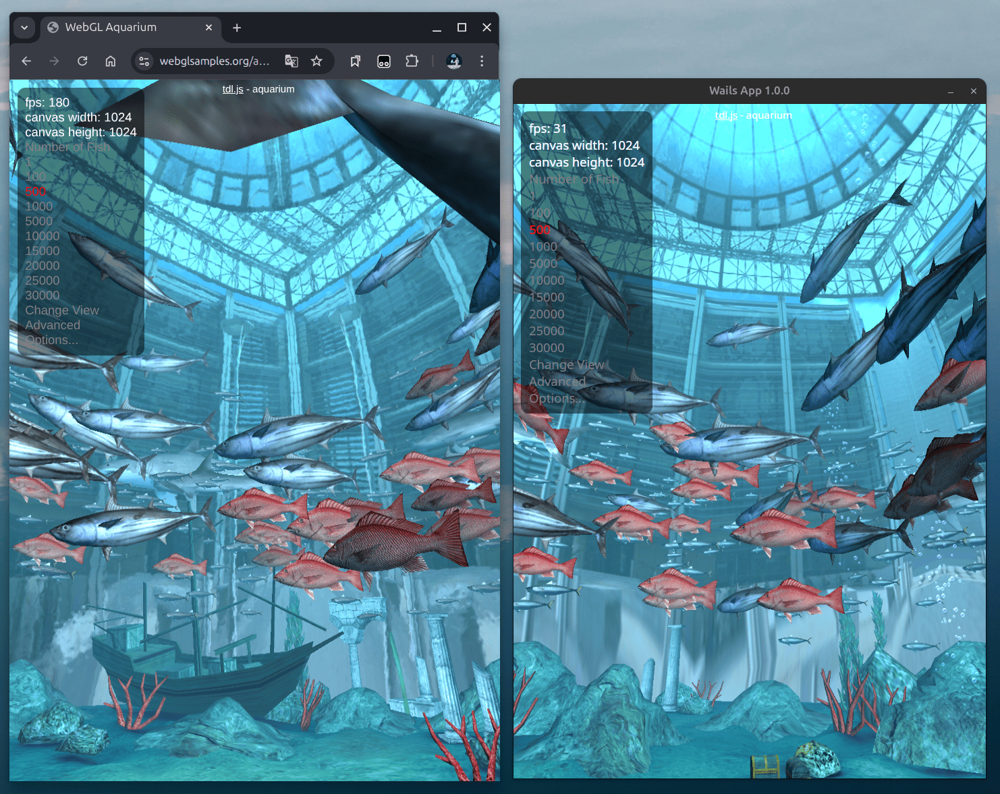

## 前言

在开发跨平台桌面应用时，我最近遇到了一个让我困惑的现象：同样的 Wails 应用在 Windows 上运行流畅，但在 Ubuntu 等 Linux 发行版上却明显卡顿，表现为动画卡顿，界面响应慢，我以为是 Wails 框架性能问题，或者是我的显卡驱动安装不完整，但排查后发现这些都不是原因。

经过一番研究，我发现 Linux 平台下 Wails 的 GPU 加速默认被禁用，而官方文档中相关说明隐藏在较长的代码块里，没有注释，初看很容易错过。这个小小的配置差异导致了明显的性能差异。

本文将总结我排查问题的思路，并提供可直接应用的解决方案，能帮你快速定位坑点并解决问题。希望可以帮助到你。

**环境信息：**

- 系统：`Ubuntu 24.04.3 LTS`
- Wails 版本：`v2.10.2`
- Go 版本：`go1.22.2 linux/amd64`
- 前端框架：`Vue 3 + Vite`

## 解决办法

先说解决方案

由于 Wails 在 Linux 平台默认是关闭 GPU 加速的，所以需要手动开启。  
在你的项目根目录中找到 **`main.go`** 文件（这是启动 Wails 和配置选项的入口文件），然后在 **`wails.Run()`** 方法里加入如下的代码

```go
// main.go
func main() {
    ...

	// Create application with options
	err := wails.Run(&options.App{
        ...

		Linux: &linux.Options{
			WebviewGpuPolicy: linux.WebviewGpuPolicyOnDemand,	//根据 Webview 决定是否启用 GPU 加速
		},
	})

}

```

`WebviewGpuPolicy`有三个参数，分别为：
| 参数 | 含义 |
| -------------------------------- | ------------------------------ |
| `linux.WebviewGpuPolicyOnDemand` | Wails 根据 Webview 决定是否启用 GPU 加速 |
| `linux.WebviewGpuPolicyAlways` | 强制始终启用 GPU 加速 |
| `linux.WebviewGpuPolicyNever` | 禁用 GPU 加速 |

根据自己需求配置即可，如果你对原因好奇，可以继续往下看。

## 背景

我在 Ubuntu 上开发 Wails 应用时，使用了 `Vuetify.js`。当页面稍微复杂时，出现明显卡顿，表现为：

- UI 动画卡顿，比如按钮/卡片的 `ripple` 效果
- 界面操作延迟，例如点击按钮后响应慢
- CPU 资源占用高

通过对比测试发现：

- 相同系统下，相同页面在 Chrome 浏览器上完全流畅
- 相同页面在 Windows 上也完全流畅

初步怀疑：

- 我的 Ubuntu 系统上显卡驱动未正确安装
- Wails 性能问题

---

## 验证 GPU 加速影响

即使在正确安装显卡驱动的情况下，问题仍然存在。我通过测试 WebGL 性能进一步确认：

| 测试环境               | 页面                                                        | FPS      |
| ---------------------- | ----------------------------------------------------------- | -------- |
| Wails                  | [Aquarium](https://webglsamples.org/aquarium/aquarium.html) | ~35 FPS  |
| Chrome（GPU 加速开启） | [Aquarium](https://webglsamples.org/aquarium/aquarium.html) | ~180 FPS |
| Chrome（GPU 加速关闭） | [Aquarium](https://webglsamples.org/aquarium/aquarium.html) | ~15 FPS  |

### Chrome 关闭 GPU 加速与 Wails 对比


### Chrome 开启 GPU 加速与 Wails 对比



结果显而易见，问题出在 **Wails 没有启用 GPU 加速**。

---

## 查阅官方文档

查看[官网文档](https://wails.io/docs/reference/options/)后，在 `Options.App` 中发现一大段 Options，其中有一个字段：

```go
Linux: &linux.Options{
    Icon: icon,
    WindowIsTranslucent: false,
    WebviewGpuPolicy: linux.WebviewGpuPolicyNever, // 默认禁用 GPU 加速
    ProgramName: "wails"
},
```

修改 `WebviewGpuPolicy` 后，界面响应速度明显提升，UI 动画流畅，界面响应延迟消失，CPU 占用也有所下降，与 Windows 表现一致。

## 总结与经验

通过这次排查，我发现：

- Wails 在 Linux 默认禁用 GPU 加速，而 Windows 默认开启，因此同样的前端页面在 Linux 上可能明显卡顿。显然这是个坑，容易被忽略。
- 修改 `main.go` 中的 `WebviewGpuPolicy` 为 `linux.WebviewGpuPolicyOnDemand` 后，动画流畅度和界面响应都恢复正常。
- 三个参数选择：
  - OnDemand：由 Webview 决定是否启用 GPU
  - Always：强制启用 GPU
  - Never：禁用 GPU

经验建议：

1. 跨平台开发时，注意不同系统默认配置差异，性能问题可能源于默认策略而非框架本身。
2. 遇到性能问题时，可以通过 WebGL 或类似工具测试。
3. 注意阅读官方文档。

希望这篇文章能帮助你解决问题。
